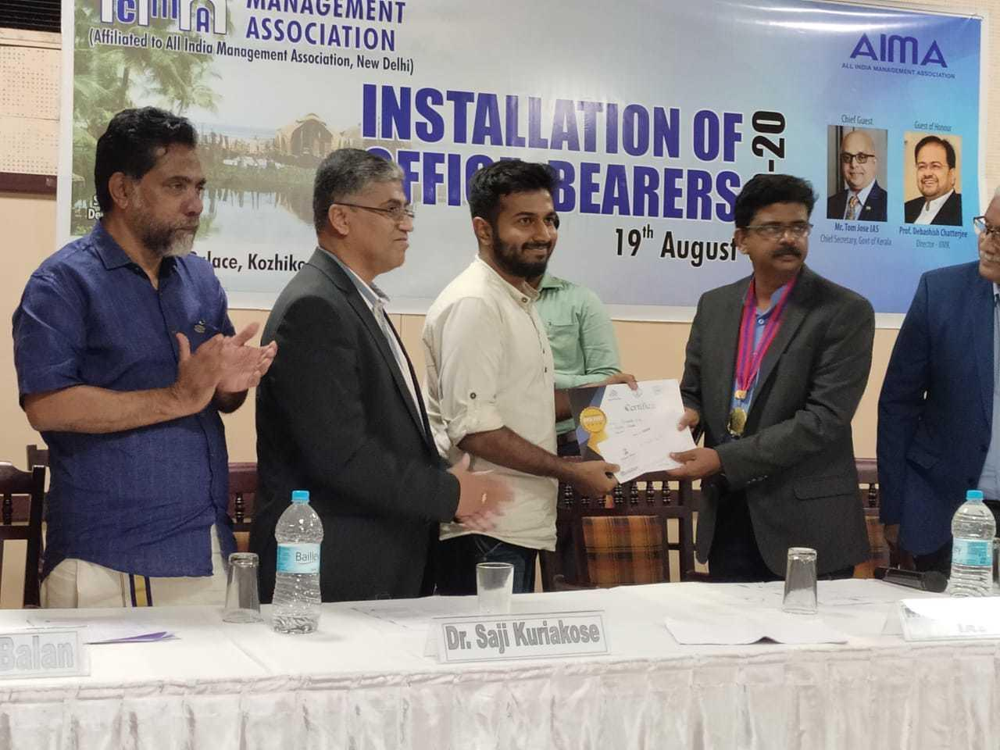
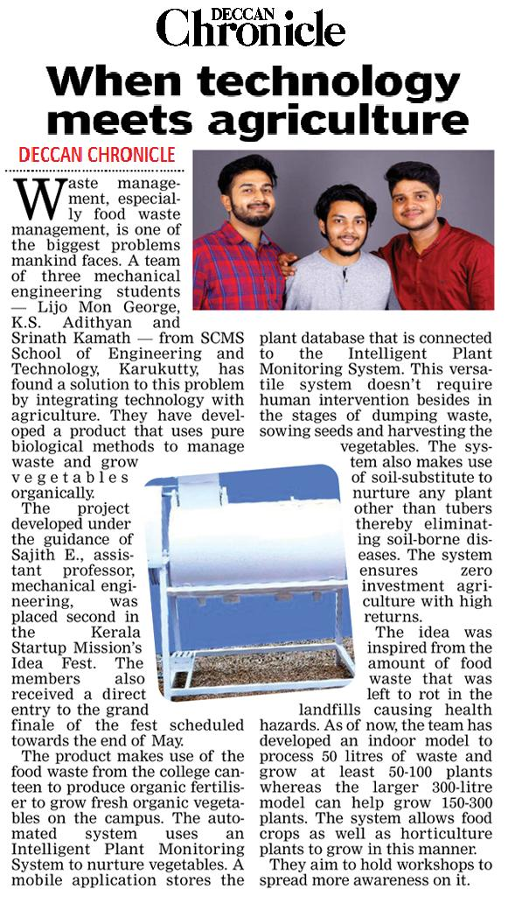

# Grovio - Automated Intelligent Plant Monitoring System

The product makes use of food waste to produce organic fertiliser to grow vegetables organically. The automated system uses an Intelligent Plant Monitoring System `(IPMS)` to nurture vegetables.
A mobile application stores the plant database that is connected to the IPMS which delivers the required amount of fertiliser according to each plant whenever required. This versatile system doesn’t require human intervention besides in the stages of dumping waste, sowing seeds & harvesting vegetables. System also uses a soil-substitute to nurture any plant other than tubers.

## Awards & Recognitions

### Kerala Startup Mission & Calicut University Idea Fest 2019 Awardee
Second prize awarded for Grovio at Calicut University Idea Fest 2019 at CMA Office Bearers Installation Ceremony, August 19, 2019.

#### The details of the project were published in Deccan Chronicle, `15 May 2019` Edition.

